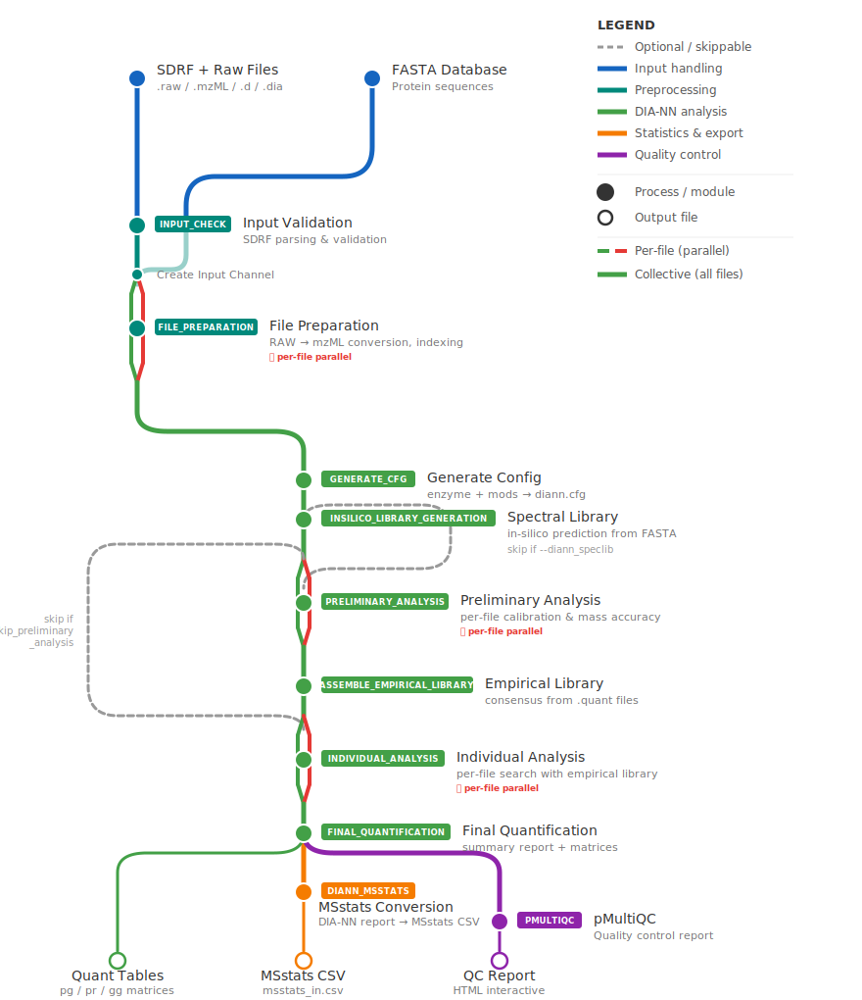

# quantmsdiann

**quantmsdiann** is an [nf-core](https://nf-co.re/) bioinformatics pipeline for **Data-Independent Acquisition (DIA)** quantitative mass spectrometry analysis using [DIA-NN](https://github.com/vdemichev/DiaNN).

## Pipeline Overview

The pipeline takes SDRF metadata and mass spectrometry data files as input, performs DIA-NN-based identification and quantification, and produces protein/peptide quantification matrices, MSstats-compatible output, and QC reports.

### Workflow Diagram

<p align="center">
  
</p>

### Supported Input Formats

| Format   | Description                         | Handling                              |
| -------- | ----------------------------------- | ------------------------------------- |
| `.raw`   | Thermo RAW files                    | Converted to mzML (ThermoRawFileParser) |
| `.mzML`  | Open standard mzML                  | Optionally re-indexed                 |
| `.d`     | Bruker timsTOF directories          | Native or converted to mzML           |
| `.dia`   | DIA-NN native binary format         | Passed through without conversion     |

Compressed formats (`.gz`, `.tar`, `.tar.gz`, `.zip`) are supported for `.raw`, `.mzML`, and `.d`.

## Quick Start

```bash
nextflow run bigbio/quantmsdiann \
    --input 'experiment.sdrf.tsv' \
    --database 'proteins.fasta' \
    --outdir './results' \
    -profile docker
```

## Key Output Files

| File | Description |
| ---- | ----------- |
| `quant_tables/diann_report.tsv` | Main DIA-NN peptide/protein report |
| `quant_tables/diann_report.pg_matrix.tsv` | Protein group quantification matrix |
| `quant_tables/diann_report.pr_matrix.tsv` | Precursor quantification matrix |
| `quant_tables/diann_report.gg_matrix.tsv` | Gene group quantification matrix |
| `quant_tables/out_msstats_in.csv` | MSstats-compatible quantification |
| `pmultiqc/` | Interactive QC HTML report |

## Test Profiles

```bash
# Quick DIA test
nextflow run . -profile test_dia,docker --outdir results

# DIA with Bruker .d files
nextflow run . -profile test_dia_dotd,docker --outdir results

# Latest DIA-NN version (2.1.0)
nextflow run . -profile test_latest_dia,docker --outdir results
```

## Documentation

- [Usage](docs/usage.md) - How to run the pipeline
- [Output](docs/output.md) - Description of output files

## Credits

quantmsdiann is developed and maintained by:

- [Yasset Perez-Riverol](https://github.com/ypriverol) (EMBL-EBI)
- [Dai Chengxin](https://github.com/daichengxin) (Beijing Proteome Research Center)
- [Julianus Pfeuffer](https://github.com/jpfeuffer) (Freie Universitat Berlin)

## License

[Apache 2.0](LICENSE)

## Citation

If you use quantmsdiann in your research, please cite:

> Dai et al. "quantms: a cloud-based pipeline for quantitative proteomics" (2024). DOI: [10.5281/zenodo.15573386](https://doi.org/10.5281/zenodo.15573386)
