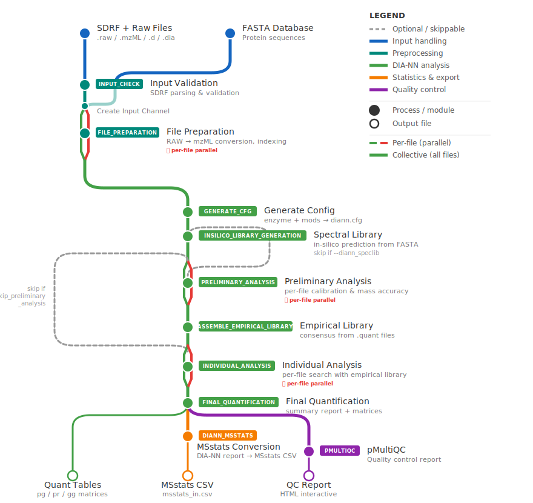

# quantmsdiann

[](https://github.com/bigbio/quantmsdiann/releases)
[](https://www.nextflow.io/)
[](https://github.com/bigbio/quantmsdiann/actions/workflows/ci.yml)

**DIA proteomics Nextflow pipeline powered by DIA-NN.**

quantmsdiann is a cloud-ready Nextflow pipeline for Data-Independent Acquisition (DIA) proteomics. It leverages [DIA-NN](https://github.com/vdemichev/DiaNN) as the core engine for peptide identification and quantification, with full integration into the quantms ecosystem.

> **DDA users:** For Data-Dependent Acquisition (LFQ, TMT/iTRAQ), use the [quantms pipeline](https://github.com/bigbio/quantms).

## Workflow Overview



## Key Features

- **DIA-NN engine**: Neural network-based peptide identification
- **Library-free mode**: No spectral library needed
- **Spectral library mode**: Use existing libraries for targeted analysis
- **Cloud-ready**: AWS, GCP, Azure, HPC, or local execution
- **SDRF metadata**: Standardized experiment annotation
- **QPX output**: Parquet-based standardized output
- **Quality control**: Integrated pmultiqc reports

## Quick Start

```bash
# Install Nextflow
curl -s https://get.nextflow.io | bash

# Run test profile
nextflow run bigbio/quantmsdiann \
    -profile test,docker \
    --outdir results/

# Run with your data
nextflow run bigbio/quantmsdiann \
    -profile docker \
    --input experiment.sdrf.tsv \
    --database uniprot_human.fasta \
    --outdir results/
```

## DIA vs DDA

| Feature             | DIA (quantmsdiann)      | DDA (quantms)         |
| ------------------- | ----------------------- | --------------------- |
| Precursor selection | All ions in window      | Top-N individual ions |
| Reproducibility     | Very high               | Moderate              |
| Missing values      | Few                     | Common                |
| Typical proteins    | 6,000-10,000            | 3,000-8,000           |
| Engine              | DIA-NN                  | Comet, MS-GF+         |
| Best for            | Large cohorts, clinical | Discovery, TMT        |

## Citation

> Dai C, Pfeuffer J, Wang H, et al. **quantms: a cloud-based pipeline for quantitative proteomics.** _Nature Methods._ 2024;21:1603-1607. [DOI: 10.1038/s41592-024-02343-1](https://doi.org/10.1038/s41592-024-02343-1)

> Demichev V, et al. **DIA-NN: neural networks and interference correction enable deep proteome coverage.** _Nature Methods._ 2020;17:41-44. [DOI: 10.1038/s41592-019-0638-x](https://doi.org/10.1038/s41592-019-0638-x)

## Ecosystem

| Tool                                             | Description                    |
| ------------------------------------------------ | ------------------------------ |
| [quantms](https://github.com/bigbio/quantms)     | DDA proteomics pipeline        |
| [mokume](https://mokume.quantms.org)             | Protein quantification library |
| [qpx](https://qpx.quantms.org)                   | Data format conversion         |
| [pmultiqc](https://pmultiqc.quantms.org)         | Interactive QC reporting       |
| [portal.quantms.org](https://portal.quantms.org) | Browse reanalyzed datasets     |
